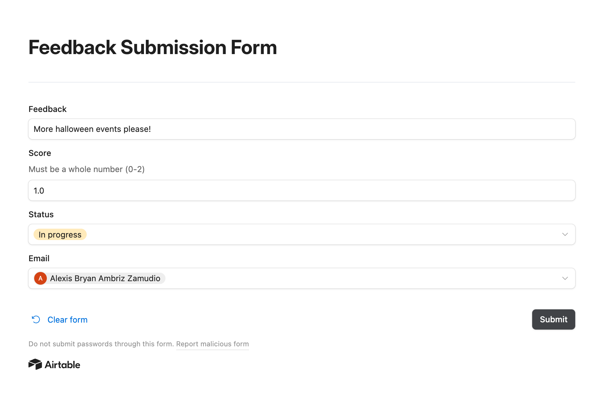
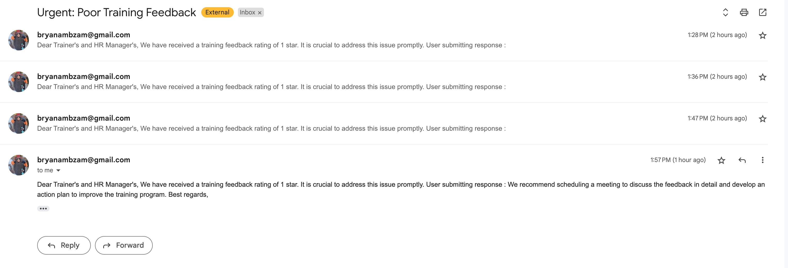
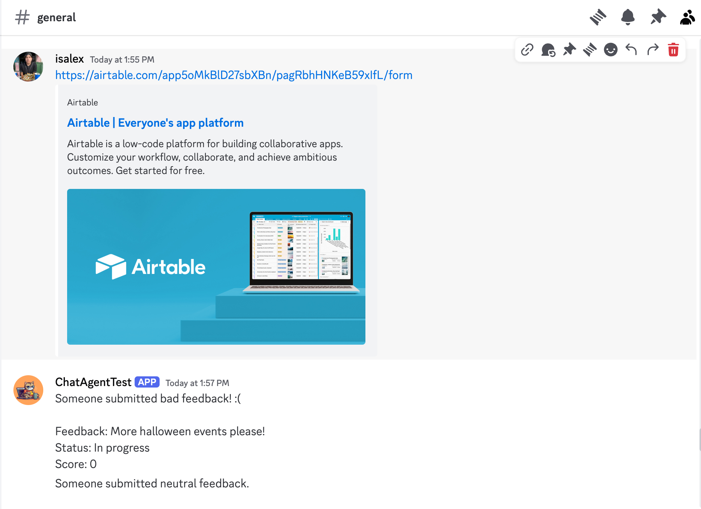

# n8n-pipelines
In this repo, I use the high-level n8n automated pipelining tool to experiment with building an automated front-end chatbot that can respond and connect to back-end event triggers. 

n8n offers a community version that is able to be hosted locally as well as free trial and paid versions that are available on their own hosted environment. For this project I was using the free trial version which allows for the pipeline to be ran on n8n's own servers.

##  Pipelines & Use-cases & Image Demos

1. A ChatGPT-4o Chatbot pipeline that is available as a bot in Discord.
2. A File-Edit notification pipeline using event triggers in Google Drive.

In these responses, the bot is able to respond using GPT-4o as it's language model and is able to detect changes in any file in a given google drive folder:

3. A Questionnaire and Follow-Back (human in the loop) pipeline.

In these responses, the bot is able to detect changes to a database of user responses to a questionnaire form and send a message to the discord depending on the feedback (bad, neutral, or good). A bad response sends me an automated email and all responses send a notification to the discord server with the details:

